<p align="center">
  
</p>

<p align="center">
  <b>El clásico Top Gear, reimaginado con gráficos modernos.</b><br>
  Carreras por 8 países, dinero por cada victoria, taller de mejoras y un concesionario con Bugatti, Ferrari, Lamborghini, Aston Martin y más.
</p>

<p align="center">
  <a href="https://1122realestate.github.io/TopGear/"></a>
  <a href="releases/TopGear-macOS.zip"></a>
  <a href="TopGear.html"></a>
</p>

<p align="center">
  
  
  
  
  
</p>

<p align="center">
  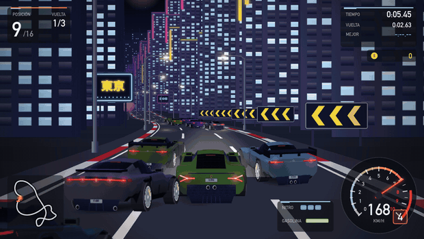
</p>

---

## 🏁 Cómo jugar

| Plataforma | Cómo abrirlo |
|---|---|
| **Navegador** (cualquier sistema) | Entra en **[1122realestate.github.io/TopGear](https://1122realestate.github.io/TopGear/)** o abre [`TopGear.html`](TopGear.html) con Chrome, Safari, Edge o Firefox. |
| **macOS** | Descarga [`releases/TopGear-macOS.zip`](releases/TopGear-macOS.zip), descomprímelo y abre **Top Gear.app**. La primera vez: clic derecho → **Abrir** → **Abrir** (la app no está notarizada). |
| **Windows** | Descarga el repositorio y haz doble clic en [`Jugar en Windows.bat`](Jugar%20en%20Windows.bat): abre el juego en una ventana de Edge o Chrome. |

Todo funciona sin conexión: gráficos, música y sonido se generan con código, sin imágenes ni librerías externas.

## 🎮 Controles

| Acción | 1 jugador | 2J · Jugador 1 (arriba) | 2J · Jugador 2 (abajo) |
|---|---|---|---|
| Acelerar / frenar | `↑` `↓` o `W` `S` | `W` `S` | `↑` `↓` |
| Girar | `←` `→` o `A` `D` | `A` `D` | `←` `→` |
| Nitro | `Espacio` o `Mayús izq.` | `Mayús izq.` | `Mayús der.` |
| Cambio manual | `E`/`X` sube · `Q`/`Z` baja | `E` / `Q` | `.` / `,` |
| Pausa · música | `Esc` / `P` · `M` | | |

Todas las teclas se pueden **reasignar** en *Opciones → Configurar controles del teclado*. En los menús: flechas, `Intro` y `Esc` (o el ratón).

## ✨ Qué incluye

<table>
<tr>
<td width="50%">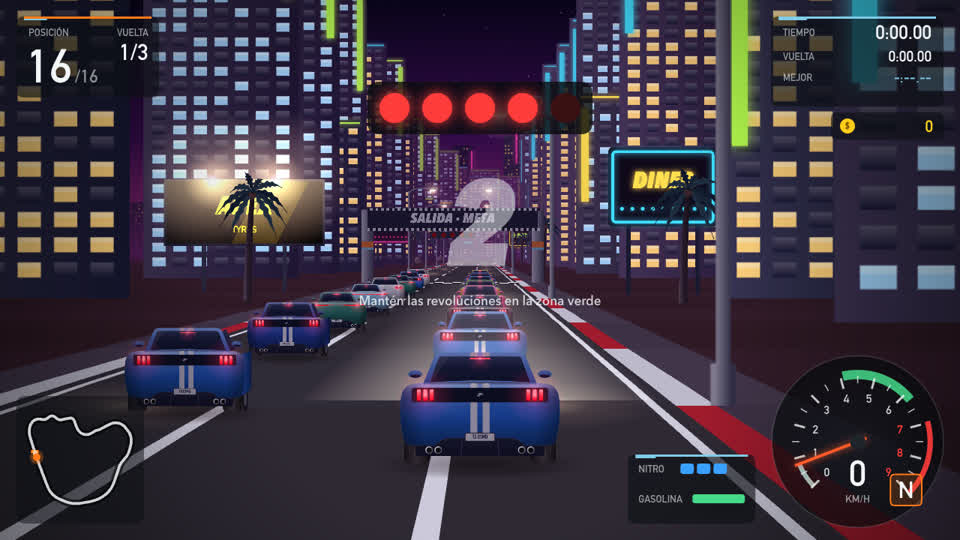</td>
<td width="50%">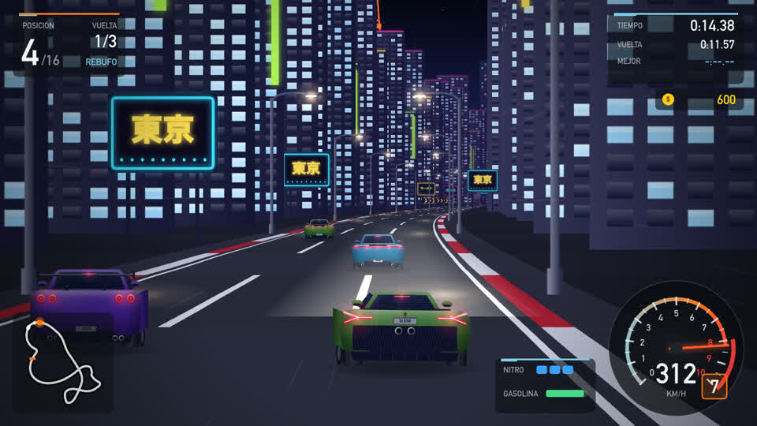</td>
</tr>
<tr>
<td><b>Salida al estilo Top Gear</b> — semáforo, cuenta atrás y salida perfecta si mantienes las revoluciones en la zona verde.</td>
<td><b>Noche con neones y faros</b> — luces de freno, reflejos en el asfalto mojado y haz de los faros sobre la carretera.</td>
</tr>
<tr>
<td>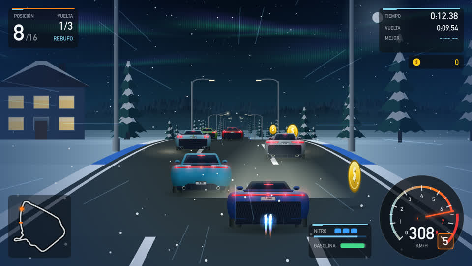</td>
<td>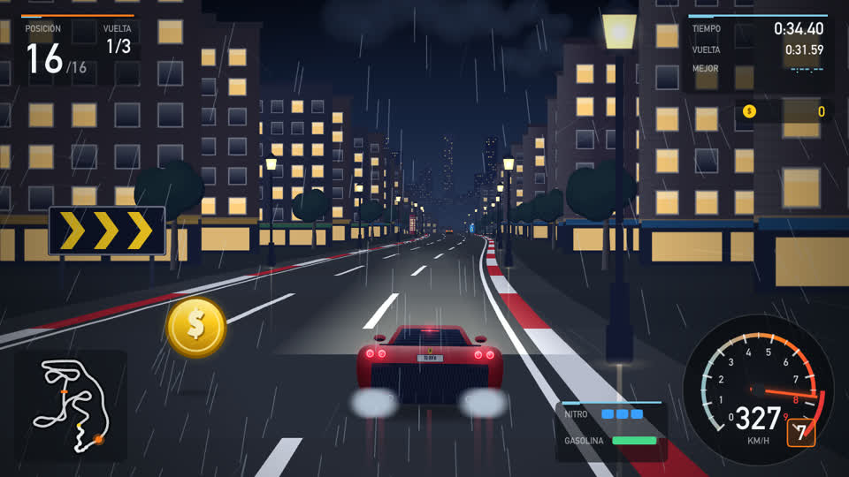</td>
</tr>
<tr>
<td><b>Clima y ambientes</b> — nieve con aurora boreal, lluvia con relámpagos, niebla, atardeceres y noches estrelladas.</td>
<td><b>Monedas, gasolina y nitro</b> — recoge monedas para ganar más dinero y bidones para no quedarte sin combustible.</td>
</tr>
</table>

- **Campeonato**: 8 copas (Estados Unidos, Sudamérica, Japón, Alemania, Escandinavia, Francia, Italia y Reino Unido) con 4 circuitos cada una. Termina en el podio para desbloquear la siguiente y ganar el trofeo de oro, plata o bronce.
- **Economía**: premio por puesto + monedas + bonus de carrera limpia y de récord de vuelta, y un bonus final de copa.
- **Taller**: 7 mejoras por coche — Motor, Turbo, Transmisión, Neumáticos, Nitro, Depósito y Chasis — con vista previa de cómo cambia el rendimiento.
- **Concesionario**: 15 coches con sus datos reales aproximados, desde el Ford Mustang GT inicial hasta el Bugatti Chiron Super Sport de 490 km/h.
- **Modos**: carrera rápida, contrarreloj con **coche fantasma** de tu mejor vuelta, y **2 jugadores en pantalla dividida** en el mismo teclado.
- **Conducción arcade**: cambio automático o manual, rebufo, saltos en los cambios de rasante, choques, 15 rivales con IA y cámara que se abre con el nitro.
- **Audio original**: 4 temas musicales propios y motores sintetizados que suenan distinto según sean V6, V8, V10, V12 o W16.
- **Partida guardada** automáticamente (en la app de Mac se guarda en disco).

<table>
<tr>
<td width="33%">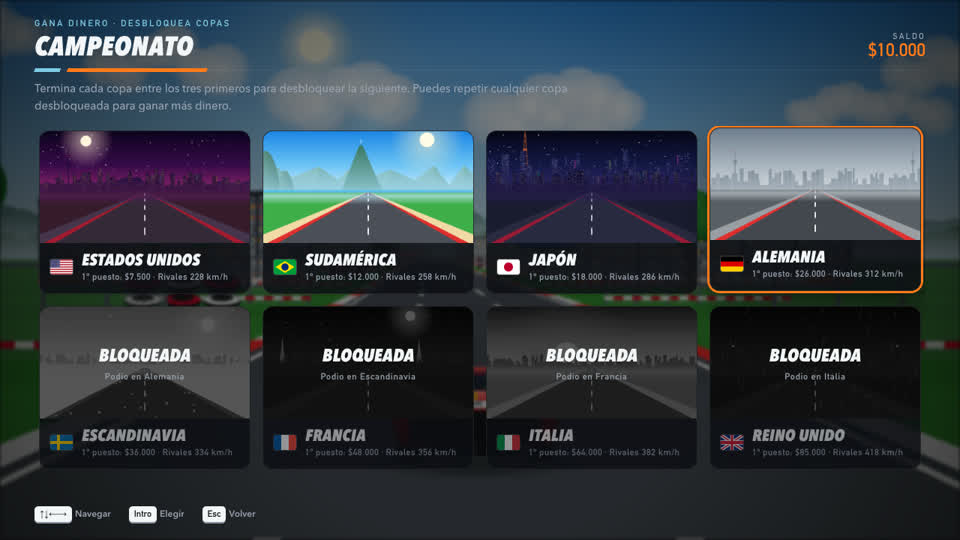</td>
<td width="33%">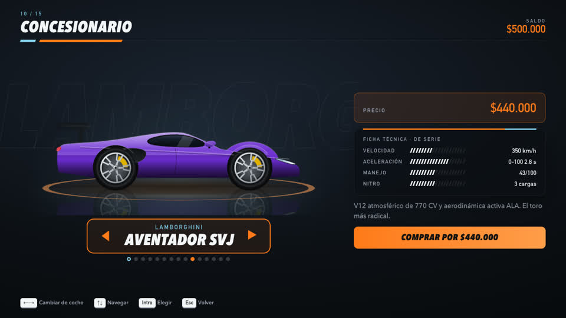</td>
<td width="33%">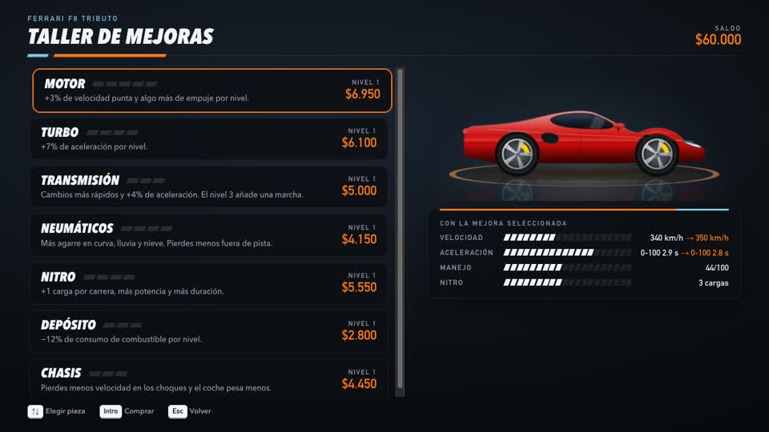</td>
</tr>
<tr>
<td align="center">Campeonato por países</td>
<td align="center">Concesionario</td>
<td align="center">Taller de mejoras</td>
</tr>
<tr>
<td>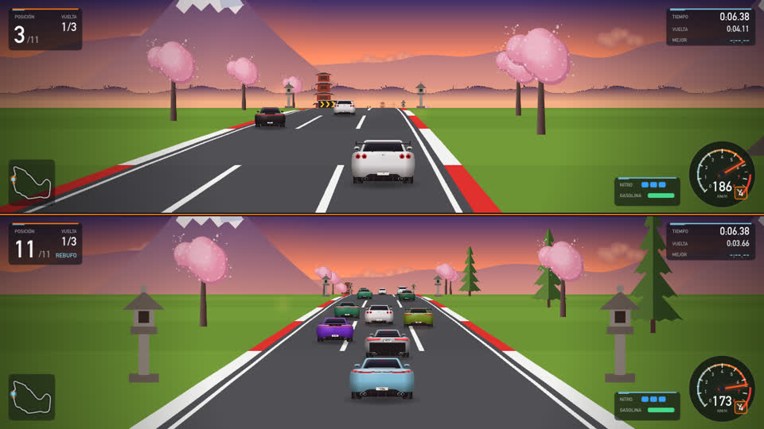</td>
<td>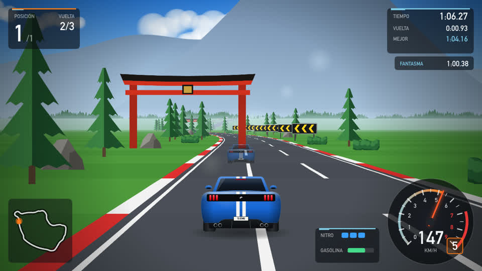</td>
<td>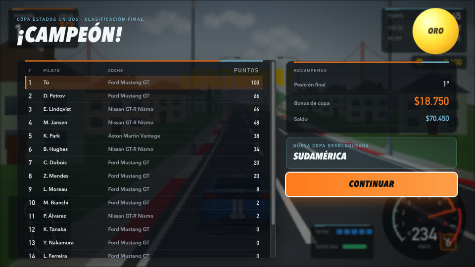</td>
</tr>
<tr>
<td align="center">2 jugadores</td>
<td align="center">Contrarreloj con fantasma</td>
<td align="center">Trofeo de copa</td>
</tr>
</table>

## 🚗 Garaje

| | Coche | Velocidad | Precio |
|---|---|---|---|
| 🇺🇸 | Ford Mustang GT | 250 km/h | Inicial |
| 🇯🇵 | Nissan GT-R Nismo | 315 km/h | $55.000 |
| 🇬🇧 | Aston Martin Vantage | 314 km/h | $78.000 |
| 🇩🇪 | Mercedes-AMG GT R | 318 km/h | $115.000 |
| 🇩🇪 | Porsche 911 Turbo S | 330 km/h | $150.000 |
| 🇩🇪 | Audi R8 V10 | 331 km/h | $185.000 |
| 🇮🇹 | Lamborghini Huracán EVO | 325 km/h | $240.000 |
| 🇬🇧 | McLaren 720S | 341 km/h | $290.000 |
| 🇮🇹 | Ferrari F8 Tributo | 340 km/h | $330.000 |
| 🇮🇹 | Lamborghini Aventador SVJ | 350 km/h | $440.000 |
| 🇮🇹 | Ferrari LaFerrari | 350 km/h | $580.000 |
| 🇫🇷 | Bugatti Veyron 16.4 | 407 km/h | $720.000 |
| 🇬🇧 | Aston Martin Valkyrie | 355 km/h | $900.000 |
| 🇸🇪 | Koenigsegg Jesko | 450 km/h | $1.300.000 |
| 🇫🇷 | Bugatti Chiron Super Sport | 490 km/h | $2.000.000 |

<p align="center">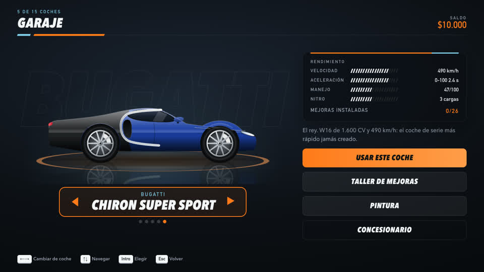</p>

## 🛠️ Estructura y compilación

```
TopGear.html          el juego completo en un único archivo
index.html            copia para GitHub Pages
Top Gear.app          app nativa de macOS (Apple Silicon + Intel)
releases/             Top Gear.app comprimida para descargar
Jugar en Windows.bat  lanzador para Windows
source/               código fuente
  js/                 motor pseudo-3D, física, IA, arte procedural, audio, interfaz
  css/                estilos de la interfaz
  mac/                lanzador Swift (WebKit) e icono
  build.js            empaqueta todo en TopGear.html
  build_mac.sh        genera TopGear.html y Top Gear.app
```

Para desarrollar, sirve `source/` con cualquier servidor estático (por ejemplo `python3 -m http.server -d source`) y abre `index.html`. Para regenerar el HTML único y la app de Mac (requiere Node.js y Xcode):

```bash
cd source && ./build_mac.sh
```

El juego es JavaScript puro sobre Canvas 2D y Web Audio, sin dependencias.

---

<p align="center"><sub>Juego de fans inspirado en el clásico <i>Top Gear</i> (1992). Todo el arte, la música y los sonidos están generados por código. Las marcas y modelos de coches pertenecen a sus respectivos dueños.</sub></p>
