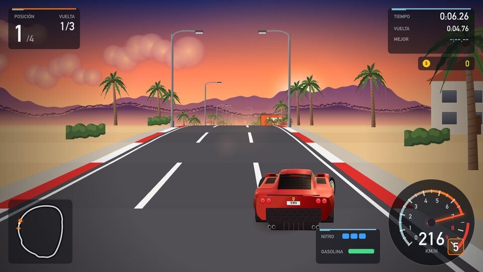
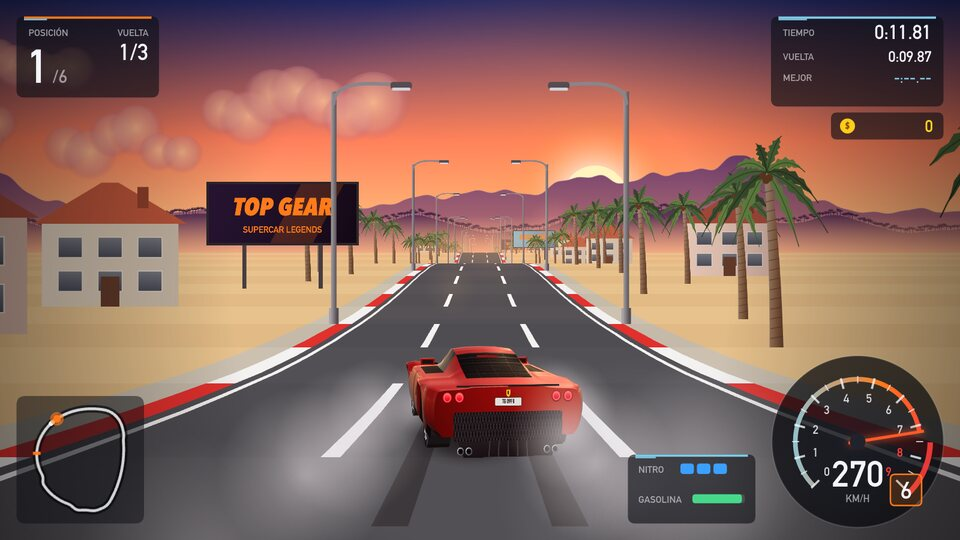
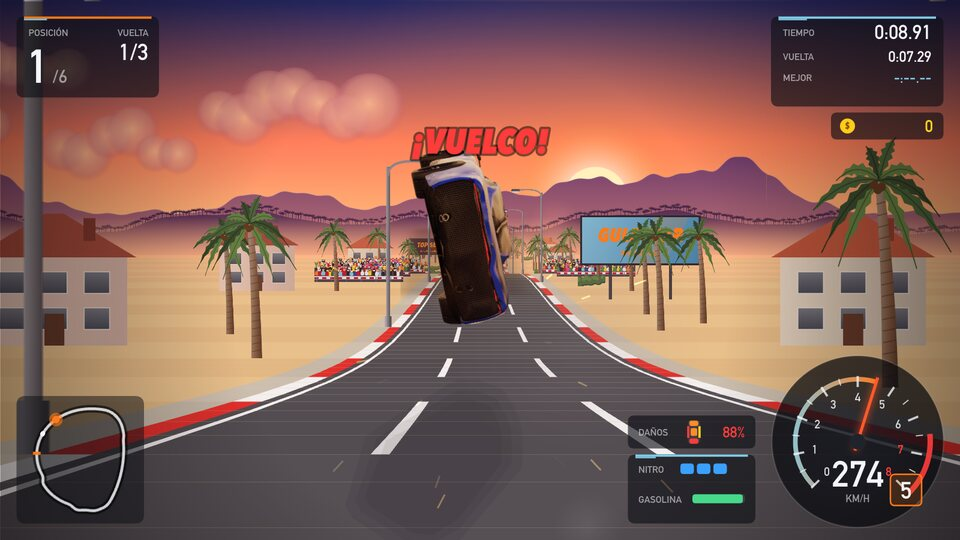
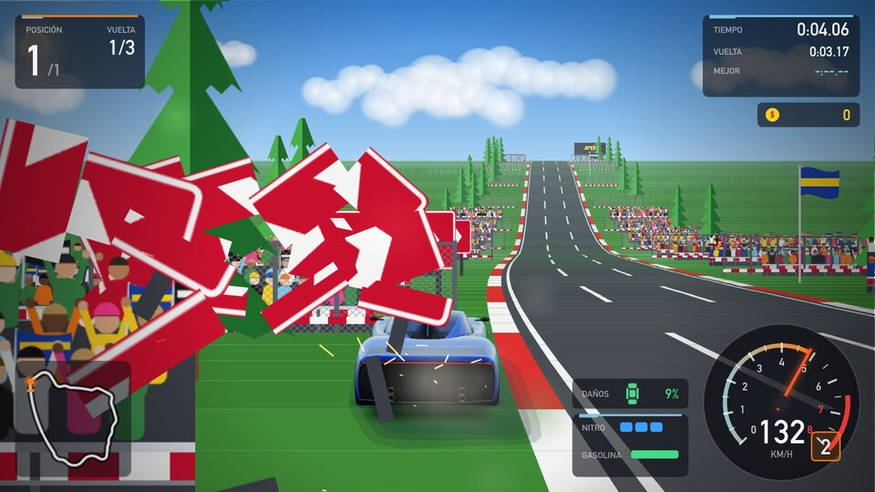
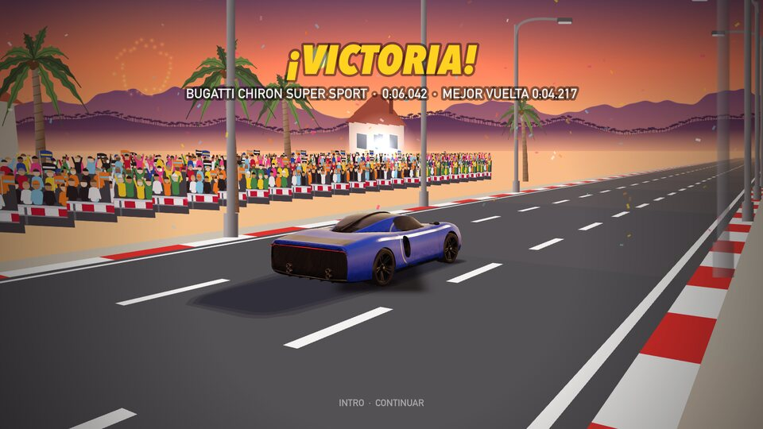

<p align="center">
  
</p>

<p align="center">
  <b>El clásico Top Gear, reimaginado con coches en 3D y gráficos modernos.</b><br>
  Carreras por 8 países, dinero por cada victoria, taller de mejoras y un concesionario con 39 coches: Bugatti, Ferrari, Lamborghini, Porsche, Aston Martin, leyendas de rally y de Le Mans.
</p>

<p align="center">
  <a href="https://1122realestate.github.io/TopGear/"></a>
  <a href="releases/TopGear-macOS.zip"></a>
  <a href="TopGear.html"></a>
</p>

<p align="center">
  
  
  
  
  
</p>

<p align="center">
  
</p>

---

## 🏁 Cómo jugar

| Plataforma | Cómo abrirlo |
|---|---|
| **Navegador** (cualquier sistema) | Entra en **[1122realestate.github.io/TopGear](https://1122realestate.github.io/TopGear/)** o abre [`TopGear.html`](TopGear.html) con Chrome, Safari, Edge o Firefox. |
| **macOS** | Descarga [`releases/TopGear-macOS.zip`](releases/TopGear-macOS.zip), descomprímelo y abre **Top Gear.app**. La primera vez: clic derecho → **Abrir** → **Abrir** (la app no está notarizada). |
| **Windows** | Descarga el repositorio y haz doble clic en [`Jugar en Windows.bat`](Jugar%20en%20Windows.bat): abre el juego en una ventana de Edge o Chrome. |

Todo funciona sin conexión: gráficos, música y sonido se generan con código, sin imágenes ni librerías externas.

## 🎮 Controles

| Acción | 1 jugador | 2J · Jugador 1 (arriba) | 2J · Jugador 2 (abajo) |
|---|---|---|---|
| Acelerar / frenar | `↑` `↓` o `W` `S` | `W` `S` | `↑` `↓` |
| Girar | `←` `→` o `A` `D` | `A` `D` | `←` `→` |
| Nitro | `Espacio` o `Mayús izq.` | `Mayús izq.` | `Mayús der.` |
| Cambio manual | `E`/`X` sube · `Q`/`Z` baja | `E` / `Q` | `.` / `,` |
| Pausa · música | `Esc` / `P` · `M` | | |

Todas las teclas se pueden **reasignar** en *Opciones → Configurar controles del teclado*. En los menús: flechas, `Intro` y `Esc` (o el ratón).

## ✨ Qué incluye

<table>
<tr>
<td width="50%"></td>
<td width="50%"></td>
</tr>
<tr>
<td><b>Salida al estilo Top Gear</b> — semáforo, cuenta atrás y salida perfecta si mantienes las revoluciones en la zona verde (si te pasas, quemas rueda).</td>
<td><b>Coches modelados en Blender</b> — los 39 coches tienen su propio modelo 3D (carrocería, ópticas, llantas, alerones) pintado en tiempo real con WebGL: laca con reflejos del cielo, oclusión ambiental, pilotos que se encienden al frenar y faros de noche.</td>
</tr>
<tr>
<td></td>
<td></td>
</tr>
<tr>
<td><b>Giran las ruedas, no la carrocería</b> — al doblar, la carrocería sigue recta y se ven las ruedas delanteras girando hacia ese lado; las cuatro gomas a la vista y rodando (dibujo de la banda y llantas que giran). Se agacha al acelerar y hunde el morro al frenar.</td>
<td><b>Derrapes con humo</b> — humo de neumáticos y marcas de goma en el asfalto al forzar en curva, humo de escape y petardeos con llamas al soltar el gas.</td>
</tr>
<tr>
<td></td>
<td></td>
</tr>
<tr>
<td><b>Daños y vuelcos</b> — la carrocería se abolla por zonas, se rayan la pintura y los cristales, se rompen los pilotos y se puede perder el alerón; un golpe muy fuerte hace volcar el coche. El daño resta velocidad y la reparación se cobra al final.</td>
<td><b>Todo se puede romper</b> — farolas, señales, vallas, barreras de neumáticos y carteles se derriban o saltan en pedazos que ruedan por el asfalto.</td>
</tr>
<tr>
<td></td>
<td></td>
</tr>
<tr>
<td><b>Vista 360° en la meta</b> — al terminar, la cámara da una vuelta completa alrededor de tu coche mientras sigue rodando, con fuegos artificiales si ganas.</td>
<td><b>Público</b> — gradas y aficionados que celebran con banderas en la salida y en varias rectas; se oye el rugido al pasar.</td>
</tr>
<tr>
<td></td>
<td></td>
</tr>
<tr>
<td><b>Clima y ambientes</b> — nieve con aurora boreal, lluvia con relámpagos, niebla, atardeceres y noches estrelladas.</td>
<td><b>Noche y lluvia</b> — agua que levantan las ruedas, reflejos de los pilotos en el asfalto mojado y haz de los faros.</td>
</tr>
</table>

- **Campeonato**: 8 copas (Estados Unidos, Sudamérica, Japón, Alemania, Escandinavia, Francia, Italia y Reino Unido) con 4 circuitos cada una. Termina en el podio para desbloquear la siguiente y ganar el trofeo de oro, plata o bronce.
- **Economía**: premio por puesto + monedas + bonus de carrera limpia y de récord de vuelta, y un bonus final de copa.
- **Taller**: 7 mejoras por coche — Motor, Turbo, Transmisión, Neumáticos, Nitro, Depósito y Chasis — con vista previa de cómo cambia el rendimiento.
- **Concesionario**: 39 coches con sus datos reales aproximados, ordenados por precio: superdeportivos, clásicos (Ferrari F40, 250 Testa Rossa, Dodge Charger 1970), leyendas de rally (Audi Quattro S1, Lancia Delta Integrale, Polo R WRC, i20 WRC) y de Le Mans (Porsche 917K, Mazda 787B, CLK GTR, Ferrari 499P, Cadillac GTP), desde el Ford Mustang GT inicial hasta el Bugatti Chiron Super Sport de 490 km/h.
- **Modos**: carrera rápida, contrarreloj con **coche fantasma** de tu mejor vuelta, y **2 jugadores en pantalla dividida** en el mismo teclado.
- **Conducción**: respuesta inmediata y precisa a la dirección (el coche va adonde apuntan las ruedas), cambio automático o manual, rebufo, saltos en los cambios de rasante, choques y cámara que se abre con el nitro.
- **Dificultad progresiva**: los 15 rivales mejoran carrera a carrera durante el campeonato y también **mejoran sus piezas** (motor, turbo y neumáticos): cada carrera de la copa muestra su nivel y sus piezas. Conducen limpio (no se cruzan para cerrarte el paso). En *Opciones* eliges Fácil, Normal o Difícil.
- **Audio original**: 4 temas musicales propios y motores sintetizados que suenan distinto según sean V6, V8, V10, V12 o W16.
- **Autoguardado**: la partida se guarda sola cada pocos segundos si algo cambia, al pausar y al cerrar la ventana, con copia de seguridad de la versión anterior (en la app de Mac se guarda en disco). En *Opciones* puedes **exportar e importar** la partida a un archivo para llevarla a otro navegador u ordenador.

<table>
<tr>
<td width="33%"></td>
<td width="33%"></td>
<td width="33%"></td>
</tr>
<tr>
<td align="center">Campeonato por países</td>
<td align="center">Concesionario</td>
<td align="center">Taller de mejoras</td>
</tr>
<tr>
<td></td>
<td></td>
<td></td>
</tr>
<tr>
<td align="center">2 jugadores</td>
<td align="center">Contrarreloj con fantasma</td>
<td align="center">Trofeo de copa</td>
</tr>
</table>

## 🚗 Garaje

| | Coche | Velocidad | Precio |
|---|---|---|---|
| 🇺🇸 | Ford Mustang GT | 250 km/h | Inicial |
| 🇺🇸 | Dodge Charger R/T 1970 | 240 km/h | $45.000 |
| 🇯🇵 | Nissan GT-R Nismo | 315 km/h | $55.000 |
| 🇮🇹 | Lancia Delta HF Integrale Evo | 220 km/h | $70.000 |
| 🇬🇧 | Aston Martin Vantage | 314 km/h | $78.000 |
| 🇩🇪 | Mercedes-AMG GT R | 318 km/h | $115.000 |
| 🇰🇷 | Hyundai i20 WRC | 200 km/h | $130.000 |
| 🇩🇪 | Volkswagen Polo R WRC | 200 km/h | $140.000 |
| 🇩🇪 | Porsche 911 Turbo S | 330 km/h | $150.000 |
| 🇩🇪 | Volkswagen Beetle Gr.3 | 270 km/h | $160.000 |
| 🇩🇪 | Audi Sport Quattro S1 E2 | 220 km/h | $180.000 |
| 🇩🇪 | Audi R8 V10 | 331 km/h | $185.000 |
| 🇮🇹 | Lamborghini Huracán EVO | 325 km/h | $240.000 |
| 🇩🇪 | Porsche 911 GT3 RS | 296 km/h | $240.000 |
| 🇮🇹 | Lamborghini Huracán EVO Spyder | 325 km/h | $260.000 |
| 🇬🇧 | McLaren 720S | 341 km/h | $290.000 |
| 🇮🇹 | Ferrari F8 Tributo | 340 km/h | $330.000 |
| 🇮🇹 | Ferrari 296 GTB Assetto Fiorano | 330 km/h | $360.000 |
| 🇩🇪 | Porsche 911 GT3 R (991.2) | 285 km/h | $420.000 |
| 🇮🇹 | Lamborghini Aventador SVJ | 350 km/h | $440.000 |
| 🇮🇹 | Ferrari F40 | 324 km/h | $450.000 |
| 🇮🇹 | Lamborghini Huracán Super Trofeo EVO2 | 290 km/h | $480.000 |
| 🇩🇪 | Porsche 911 GT3 R (992) | 290 km/h | $520.000 |
| 🇮🇹 | Ferrari LaFerrari | 350 km/h | $580.000 |
| 🇮🇹 | Ferrari 296 GT3 | 300 km/h | $600.000 |
| 🇫🇷 | Bugatti Veyron 16.4 | 407 km/h | $720.000 |
| 🇯🇵 | Mazda LM55 Vision GT | 340 km/h | $850.000 |
| 🇬🇧 | Aston Martin Valkyrie | 355 km/h | $900.000 |
| 🇮🇹 | Ferrari Daytona SP3 | 340 km/h | $950.000 |
| 🇩🇪 | Mercedes-Benz CLK GTR Roadster | 320 km/h | $1.100.000 |
| 🇮🇹 | Ferrari 250 Testa Rossa | 270 km/h | $1.200.000 |
| 🇸🇪 | Koenigsegg Jesko | 450 km/h | $1.300.000 |
| 🇯🇵 | Mazda 787B | 340 km/h | $1.300.000 |
| 🇺🇸 | Cadillac V-Series.R (GTP) | 330 km/h | $1.400.000 |
| 🇩🇪 | Porsche 917K (Gulf) | 360 km/h | $1.500.000 |
| 🇦🇪 | Devel Sixteen | 420 km/h | $1.600.000 |
| 🇮🇹 | Ferrari 499P | 340 km/h | $1.800.000 |
| 🇫🇷 | Bugatti Bolide | 380 km/h | $1.900.000 |
| 🇫🇷 | Bugatti Chiron Super Sport | 490 km/h | $2.000.000 |

<p align="center"></p>

## 🛠️ Estructura y compilación

```
TopGear.html          el juego completo en un único archivo
index.html            copia para GitHub Pages
Top Gear.app          app nativa de macOS (Apple Silicon + Intel)
releases/             Top Gear.app comprimida para descargar
Jugar en Windows.bat  lanzador para Windows
source/               código fuente
  js/                 motor pseudo-3D, física, IA, arte procedural, audio, interfaz
    car-models.js     los 39 coches exportados desde Blender
    car-gl.js         pintado de los coches con WebGL
    car3d.js          coches 3D en Canvas 2D (si no hay WebGL) y sombras
    finish.js         vista 360° de la meta
  blender/            scripts de Python que modelan cada coche en Blender
  css/                estilos de la interfaz
  mac/                lanzador Swift (WebKit) e icono
  build.js            empaqueta todo en TopGear.html
  build_mac.sh        genera TopGear.html y Top Gear.app
```

Para desarrollar, sirve `source/` con cualquier servidor estático (por ejemplo `python3 -m http.server -d source`) y abre `index.html`. Para regenerar el HTML único y la app de Mac (requiere Node.js y Xcode):

```bash
cd source && ./build_mac.sh
```

El juego es JavaScript puro sobre Canvas 2D, WebGL y Web Audio, sin dependencias. Los coches se modelan con scripts de Python para Blender (`source/blender/`, exportados con `export_game.py` a `source/js/car-models.js`) y el juego los pinta con WebGL (`source/js/car-gl.js`); si WebGL no está disponible, usa coches 3D generados en Canvas 2D (`source/js/car3d.js`).

---

<p align="center"><sub>Juego de fans inspirado en el clásico <i>Top Gear</i> (1992). Todo el arte, la música y los sonidos están generados por código. Las marcas y modelos de coches pertenecen a sus respectivos dueños.</sub></p>
